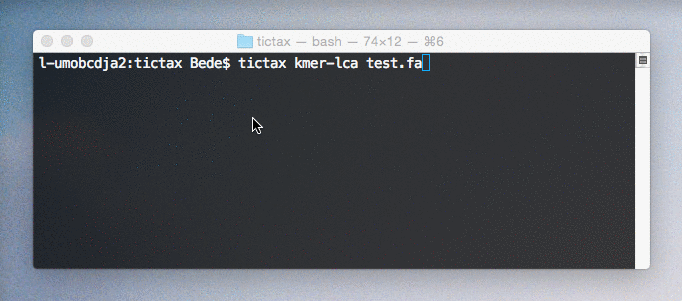
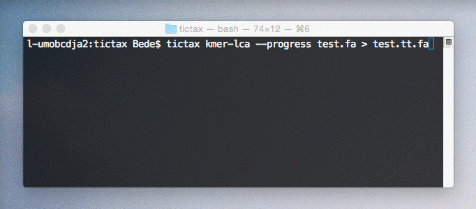

# tictax: streaming sequence classification with web services

Rapid lowest common ancestor (LCA) assignment from command line or Python using One
Codex and EBI APIs. Capable of hundreds of requests per second with short queries.  

Scientific names and lineages are retrieved through chained requests to the EBI 
taxonomy and annotated within fasta description fields for easy viewing and parsing.

## Command line usage
```
$ tictax kmer-lca test.fa
```

```
$ tictax kmer-lca --progress test.fa > test.tt.fa
```
  

### Built-in help
```
$ tictax -h
usage: tictax [-h] {kmer-lca} ...

positional arguments:
  {kmer-lca}
    kmer-lca  Lowest common ancestor sequence assignment using the One Codex
              API. Streams annotated records to stdout in fasta format. Taxa
              assigned using the One Codex 31mer LCA database.

optional arguments:
  -h, --help  show this help message and exit
```
```
$ tictax kmer-lca -h
usage: tictax kmer-lca [-h] [-p] fasta-path

    Lowest common ancestor sequence assignment using the One Codex API.
    Streams annotated records to stdout in fasta format.
    Taxa assigned using the One Codex 31mer LCA database.
    

positional arguments:
  fasta-path      path to fasta formatted input

optional arguments:
  -h, --help      show this help message and exit
  -p, --progress  show progress bar (sent to stderr) (default: False)
```

## Python API usage
### `kmer_lca_records(fasta_path, one_codex_api_key, progress=False)`
- Returns Biopython SeqRecords with tictax annotations as the `description` attribute  
- LCAs are assigned using an LCA index of 31mers from the One Codex database
```python
import tictax

records = tictax.parse_fasta('test.fa') # Biopython SeqRecord generator 
records_classified = tictax.kmer_lca_records(records, one_codex_api_key) # List of SeqRecords
print(records_classified.format('fasta')) # Generate multifasta
```

## Installation
Requires Python 3.5+. Installs with pip. No external dependencies.
```
pip3 install tictax
```

## Issues
Feel free to open issues and PRs, else [tweet](https://twitter.com/beconstant) or mail me via `b àt bede dawt im`.

## Todo ✓📌
- [x] Switch to semicolon delimiters
- [ ] Add ebiblastn LCA functionality
- [x] Add in onecodexrt / ebiblastn
- [ ] `kmer-lca` command `--out` option for two column id to LCA info
- [ ] `abundance` command for generating taxonomic abundances matrices at a specified rank
- [ ] Stream input from stdin